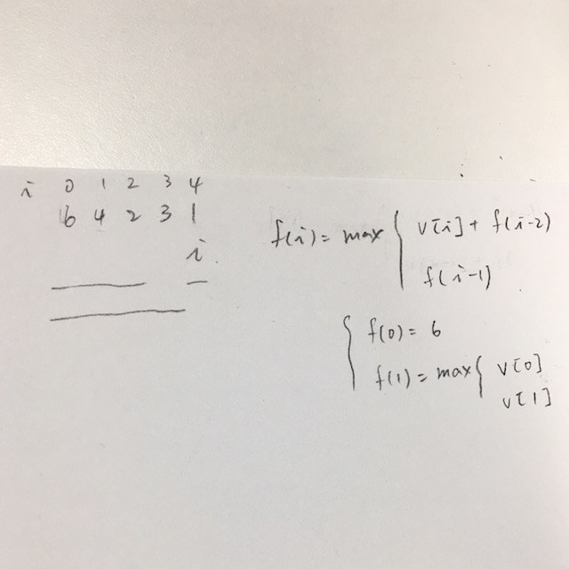

# Algorithm Notes

### House Robber III

* 2016/09/24
* [http://www.cnblogs.com/grandyang/p/5275096.html](http://www.cnblogs.com/grandyang/p/5275096.html)
* there is no way to use javascript object's reference as hash key, so it's hard to do tree recursive call with memorization

### Course Schedule II

* 2016/09/23

### Course Schedule

* 2016/09/21
* [Directed Graphs](http://www.cs.princeton.edu/courses/archive/spring07/cos226/lectures/20DirectedGraphs.pdf)
* [Directed Graphs](http://algs4.cs.princeton.edu/42digraph/)
* [topological-sorting](http://songlee24.github.io/2015/05/07/topological-sorting/)

### House Robber II

* 2016/09/20

### Search for A Range

* 2016/09/19

### Search Insert Position

* 2016/09/19

### House Robber

* 2016/09/19

